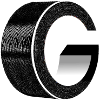

# affa.js

## Recently changed

A list of changes, and how to upgrade is available in the [wiki](https://github.com/gaffa-tape/gaffa-js/wiki/_pages)

## Example

[gaffa-template](http://korynunn.github.io/gaffa-template/)

## Quick n easy setup

    git clone git@github.com:KoryNunn/gaffa-template.git

the template repo is a good starting point for an application.

## Overview
Gaffa attempts to speed up the development of complicated UI's by providing a rich binding layer between arbitrary data and your UI.

Writing UI's using gaffa is unlike most other MVC/MVVM/etc frameworks for a number of different reasons. (Although, others share some of the below points)

* ASAP databinding - model change events are instantaneous
* Extremely powerful model bindings - use complex expressions to bind to data
* UI by transform  - Use transforms over data to affect how data is displated, rather than modifying the data to suite the UI.
* NO HTML! - Javascript to DOM, no pointless middleman.
* Serialise to JSON - An entire application can be serialised to JSON, by design.
* No lock-in - Push your views to the edge of Gaffa's capabilities, and break out whenever you need.

### Dependencies

Gaffa must be compiled with browserify [browserify](https://github.com/substack/node-browserify)

### Example minimal usage

	var Gaffa = require('../'),
	    Text = require('gaffa-text'),
	    Textbox = require('gaffa-textbox'),
	    gaffa = new Gaffa();

	// Register used viewItems with gaffa
	gaffa.registerConstructor(Text);
	gaffa.registerConstructor(Textbox);

	// create a text view
	var text = new Text();
	text.text.binding = '(join " " "Current value of [value]:" [value])';

	// create a textbox view
	var textbox = new Textbox();

	// Bind the textbox's value to model.value
	textbox.value.binding = '[value]';

	// Tell the textbox to set it's value on keyup
	textbox.updateEventName = 'keyup';

	// An example model
	gaffa.model.set({
	    value:'things'
	})

	// Add the view on load.
	window.onload = function(){
	    gaffa.views.add([
	        text,
	        textbox
	    ]);
	};

	// Globalise gaffa for easy debugging.
	window.gaffa = gaffa;
